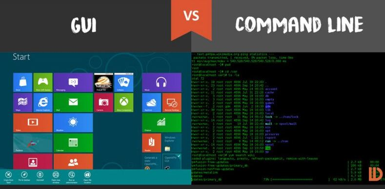

--- Week: "1" Lesson: "Intro to VACC & Command Line" Date: "Tuesday,
January 16, 2024" ---

# Learning Objectives for Today's Lesson
- Log into the VACC, a high-performance computing cluster - Basics in
navigation in CLI + Copy data into your home directory + List files in a
directory

***

# Introduction to Command Line 
Command line interface (CLI) and graphical user interface (GUI) are
different ways of interacting with a computer's operating system. Most
people are familiar with the GUI as it is the default interface for most
software. When using a GUI, you see visual representations of files,
folders, applications, etc. However, when using the CLI, you will work
largely with text representation of files, folders, input, and output.
The shell is a program that presents a command line interface that
allows you to control your computer by typing instructions with a
keyboard. Using command line, you will be able to create new files, edit
the contents of those files, delete files, and much more.

<p align="center"> 
</p>

### Benefits of using command line 
Underneath the Graphical User Interface (GUI) of  your computer is
the	command line that runs your  Operating System (OS). Working this
way gives you access to internal  controls, remote servers, and	the
ability to  customize workflows (scripts). So it gives you the ability
to create new files, edit the contents of those files, delete files, and
much more.

## How to access the shell
On a Mac or Linux machine, you can access a shell through a program
called "Terminal" locally on your laptop. But to make things easier, we
will be using terminal on the open source web portal called Vermont
Advance Computing Center - Open OnDemand (VACC-OOD). Once on terminal,
you will be learning the basics of shell programming available under the
Bourne Again Shell (bash).

***

## Introduction to Vermont Advance Computing Center Cluster (VACC)

What is the Vermont Advance Computing Center? To answer this, let's take
a quick look at the basic architecture of a cluster environment.

<p align="center">  </p>

The image above reflects the many computers that make up a cluster. Each
individual computer in the cluster is a lot more powerful than any
laptop or desktop computer we are used to working with, and is referred
to as a **"node"** (instead of computer). Therefore, a "cluster" is a
large system consisting of 100s-1000s of nodes. Each node has a
designated role, either for logging in or for performing computational
analysis/work. A given cluster will usually have a few login nodes and
several compute nodes.

**Common characteristics of a Cluster:**

+ Large memory + Storage shared across nodes + High speed
interconnection network; suitable for high-throughput applications +
Shared by many users

***

**As of March 2022, the VACC provides three Clusters:**

+ BlackDiamond + Bluemoon + DeepGreen

We will primarily use the **Bluemoon** cluster for any downstream
analysis.

<p align="center">  </p>

Please note that more information can always be found at the [Vermont
Advanced Computing Center website](https://www.uvm.edu/vacc).

***

## VACC-OOD Overview 

Each student has been provided with their own personal VACC account that
they can use to access VACC-Open OnDemand (OOD).

### What is Open OnDemand (OOD)?  
Open OnDemand (OOD) is an open source web portal for high performance
computing (HPC) that provides users with an *easy-to-use* web interface
to HPC clusters.

**Benefits of using OOD:**

1. Web-based, no additional software needs to be installed on your local
machine

2. The easiest way to run graphical user interface (GUI) applications
remotely on a cluster

3. Typical computing with command-line requires a *high learning curve*
whereas OOD is easy to use and simple to learn

**GUI applications offered by VACC-OOD:**

+ Equipped with **Terminal**: this is used to perform tasks on the
command line (shell), both locally and on remote machines.

<p align="center">  </p>

+ RStudio: an integrated development environment for R

<p align="center">  </p>

### How to log-in to VACC-OOD (You should always do this!):  

1. Use the [VACC-OOD](https://vacc-ondemand.uvm.edu) link to access the
site https://vacc-ondemand.uvm.edu

2. Add your uvm netid and password

3. You should be viewing the following dashboard

<p align="center">  </p>

4. To access the Terminal Go to <button>Clusters</button>  and click
`>_VACC Shell Access`

<p align="center"> 
</p>

### How to log-in without VACC-OOD (Advanced users)
 
If you already had a VACC account and/or are currently working towards
generating and analyzing your own data, you may want to learn to log-in
without VACC-OOD.

To do so, first open your terminal locally on your computer.

<p align="center">  </p>

You see the "$" symbol?

That is where you write the "commands" that will be executed by shell
(bash in this case) and your computer's kernel.

The "$" is called the **"command prompt"**.

<p align="center">  </p>

To connect to the login node on VACC:

1. Type in the `ssh` command at the command prompt followed by a space,
and then type your username (e.g. uvm        net id) plus the address of
the cluster `@vacc-user1.uvm.edu`.

  ```bash ssh username@vacc-user1.uvm.edu ```
  > ssh means secure shell, and this is a method of securely
  > communicating with another computer. 
  > 
2. Press the return/enter key and you should receive a prompt for your
password. Type in your password and note   that **the cursor will not
move as you type** it in! This is normal and know that the computer is
receiving and  transmitting your typed password to the remote system,
i.e. the VACC cluster.

  <p align="center">  </p>

3. If this is the first time you are connecting to the cluster, **a
warning will pop up** and will ask you if you are sure you want to do
this; **type `Yes` or `Y`**.

> **Tip** - Syntax for all commands on the command-line interface is the
> command followed by space and then     optionally a few arguments.
> 
Once logged in, you should see a new command prompt:

<p align="center">  </p>

### Using VACC-OOD OFF-campus

To use the https://vacc-ondemand.uvm.edu/pun/sys/dashboard OFF-campus
you will need to VPN first. See
https://www.uvm.edu/it/kb/article/install-cisco-vpn/ for more
information!

***

## Copying example data folder  

Now that we are logged-in to the VACC, lets explore terminal. Your
screen should look similar to the following:

<p align="center">  </p>

The "$" is called the **"command prompt"**.

The command prompt on VACC will have some characters before the `$`,
something like `[username@vacc-user1 ~]`, this is telling you your
username and the name of the login node you have connected to.

***The dollar sign is a prompt which shows us that the shell is waiting
for input. Moving forward, when typing commands, either from these
lessons or from other sources, do not type in the command prompt $, only
the command that follows it.***

The first thing to do is to check if there are any files in the data
folder we are currently in. When you log in to a cluster, you will land
within a folder designated specifically for your use, and is referred to
as your "home directory". We will begin introducing a few commands that
are used to list, create, inspect, rename, and delete files and/or
directories.

Let's list the contents of our home directory using a command called
`ls`.

```bash ls ```
> **Tip** - `ls` stands for "**l**i**s**t" and it lists the contents of
> a directory. 
> 
**Question for students: What folders are you currently seeing in your
home directory?**

Now let's bring in a data folder from a different location on the
cluster to our home directory by using the `cp` command. **Copy and
paste the following command** all the way from `cp` and including the
period symbol at the end `.`

```bash cp -r /gpfs1/cl/mmg232/course_materials/tutorials/unix_lesson .
```

> Let's break this down.  
'cp' is the command for copy. This command required you to specify the
location of the item you want to copy
(/gpfs1/cl/mmg232/course_materials/tutorials/unix_lesson) and the
location of the destination (.); please note the space between the two
in the command. The “-r” is an option that modifies the copy command to
do something slightly different than usual. The "." means "here", i.e.
the destination location is where you currently are.

Now, you should see "unix_lesson" show up as the output of `ls`. This is
a folder we should all have in our home directory.

``` ls ```

<p align="center">  </p>

## Listing contents of data folder 
## 
Let's look at what is inside the folder "unix_lesson" and explore this
further. We are use to clicking on a folder name to open it, however,
now we are forced to change our mindset and open a folder or "directory"
differently within the shell environment.

To look inside the `unix_lesson` directory, we need to change which
directory we are *in*. To do this we can use the `cd` command, which
stands for "change directory".

```bash cd unix_lesson ```

Notice the change in your command prompt. The "~" symbol from before
should have been replaced by the string `unix_lesson`. This means that
our `cd` command ran successfully and we are now *in* the new directory.
Let's see what is in here by listing the contents:

```bash ls ```

You should see:

``` genomics_data  other  raw_fastq  README.txt  reference_data ```
Notice that `ls` has printed the name of the files and directories in
the current directory in alphabetical order, arranged neatly into
columns.

### Arguments
### 
There are five items listed when you run `ls`, but how do you know if
these are files or directories with more items inside?

To answer this question, we can modify the default behavior of `ls` by
adding an **"argument"** to get more information.

```bash ls -F ```

``` genomics_data/  other/  raw_fastq/  README.txt  reference_data/ ```

Anything with a "/" after its name is a directory. Things with an
asterisk "*" after them are programs.  If there are no "decorations"
after the name, it's a normal text file.

Each line of output represents a file or a directory. The directory
lines start with `d`.

### How to get more information on Arguments
### 
Most commands will take additional arguments that control their
behavior. How do we know what arguments are available for a particular
command? The most commonly used shell commands have a manual available
that can be accessed using the `man` command. Let's try this command
with `ls`:

```bash man ls ```

This will open the manual page for `ls` and you will lose the command
prompt. It will bring you to a so-called "buffer" page, a page you can
navigate with your mouse or if you want to use your keyboard we have
listed some basic key strokes:

* 'spacebar' to go forward * 'b' to go backward * Up or down arrows to
go forward or backward, respectively

**To get out of the `man` "buffer" page and to be able to type commands
again on the command prompt, press the `q` key!**

***

## Class Exercise 
## 
### Task 1: 
* On Terminal, open the manual page for the `cp` command. Skim through
the information.

1)  What does the -u option stand for and what does it do? 2)  Which
option would you use to explain what is being done (i.e. verbose)?

* Quit the `man` buffer page and come back to your command prompt.

> **Tip** - Shell commands can get extremely complicated. No one can
> possibly learn all of these arguments, of course. So you will probably
> find yourself referring to the manual page frequently.
> 
> **Tip** - If the manual page within the Terminal is hard to read , the
> manual exists online too. For example, here is the linux manual page
> for `cp`. https://man7.org/linux/man-pages/man1/cp.1.html In addition
> to the arguments, you can also find good examples online; ***Google is
> your friend.***
> 
> 
### Task 2: 
### 
* Use the `-l` option for the `ls` command to display more information
for each item in the `unix_lesson` folder. What additional information
is provided that you didn't see with the bare `ls` command?

***

## Navigating the Filesystem
A filesystem organizes a computer's files and directories into a tree
structure.

<p align="center">  </p>

+ The first directory in the filesystem is the **root directory**. It is
the parent of all other directories and files in the filesystem. That
`/` or root is the 'top' level.

+ Each parent directory contains child directories and/or files.

+ Each child directory can also contain more files

+ Note: When you log in to a remote computer you land on one of the
branches of that tree, i.e. your pre-designated "home" directory that
usually has your login name as its name (e.g. `/users/username`).

+ "Root" = Where the address system of the computer starts + "Home" =
where the users locations starts

To navigate the file system with ease we will now introduce the concept
of **tab completion**.

### Shortcut: Tab Completion 
### 
<kbd>tab</kbd> <kbd>caps lock</kbd>

Typing out file or directory names can waste a lot of time and its easy
to make typing mistakes. Instead we should get in the habit of using tab
complete as a shortcut. The `tab` key is located on the left side of
your keyboard, right above the `caps lock` key. When you start typing
out the first few characters of a directory name, then hit the `tab`
key, Shell will try to fill in the rest of the directory name. Let's put
this into practice now.

Navigate into the `raw_fastq` directory and see what's inside.
**Remember to use tab!**

```bash cd raw_fastq/ ```

Question: Where is `raw_fastq` in relation to our home directory?

### Paths
### 
To answer this, let's learn more about the "addresses" of directories,
called **"path"** and move around the file system.

Let's check to see what directory we currently are in. The command
prompt tells us which directory we are in, but it doesn't give
information about where the `raw_fastq` directory is with respect to our
"home" directory or the `/` directory.

The command to check our current location is `pwd`, this command does
not take any arguments and it returns the path or address of your
**p**resent **w**orking **d**irectory (the folder you are in currently).

```bash pwd ```

<p align="center">  </p>

In the output above, each folder is separated from its "parent" or
"child" folder by a "/", and the output starts with the root `/`
directory. So, now you are able to determine the location of `raw_fastq`
directory relative to the root directory.

But what if you would like to navigate back to your home directory? No
worries, just type `cd` and this will bring you back to your home
directory.

```bash cd ```

After doing this what is your present working directory now?

```bash pwd ```

It should look something like this: ```
/users/p/d/pdrodrig
```

This should display a shorter string of directories starting with root.
This is the full address to your home directory, also referred to as
"**full path**". The "full" here refers to the fact that the path starts
with the root, which means you know which branch of the tree you are on
in reference to the root.


### Using paths with commands
### 
You can do a lot more with the idea of stringing together *parent/child*
directories. Let's say we want to look at the contents of the
`raw_fastq` folder, but do it from our current directory (the home
directory). We can use the list command and follow it up with the path
to the folder we want to list!

```bash cd

ls ~/unix_lesson/raw_fastq ```

``` Irrel_kd_1.subset.fq	Irrel_kd_3.subset.fq	Mov10_oe_2.subset.fq
Irrel_kd_2.subset.fq	Mov10_oe_1.subset.fq	Mov10_oe_3.subset.fq ```

Now, what if we wanted to change directories from `~` (home) to
`raw_fastq` in a single step?

```bash cd ~/unix_lesson/raw_fastq ```
> Note: You can always copy-and-paste commands, but I do suggest typing
> it yourself to practice. 
> 
Good job, you have moved 2 levels of directories with one command!

Now, what if we want to move back up a level back into the `unix_lesson`
directory? Type `cd unix_lesson` and see what happens.

*Unfortunately, that won't work because when you say `cd unix_lesson`,
shell is looking for a folder called `unix_lesson` within your current
directory, i.e. `raw_fastq`.*

Can you think of an alternative?

+ You can use the full path to `unix_lesson`

+ You can do cd .. (allows you to move one folder up)

```bash cd .. ```

### File Names 
### 
Probably one of the most frustrating parts of bioinformatics is the lack
of consistency with how files are labeled. Files often have obscure
names that is only relevant to the researcher, or have names that are
**very** similar to one another. But nonetheless we will continue!

Let's go into the `raw_fastq`, then type `ls Mov10_oe_`, followed by
pressing the `tab` key once:

```bash cd raw_fastq/ ls Mov10_oe_<tab> ```

**Notice that nothing happens!!**

The reason is there are multiple files in the `raw_fastq` directory that
start with `Mov10_oe_`. As a result, shell does not know which one to
fill in. When you hit `tab` a second time again, the shell will then
list all the possible choices.

```bash ls Mov10_oe_<tab><tab>

Mov10_oe_1.subset.fq  Mov10_oe_2.subset.fq  Mov10_oe_3.subset.fq ```

Now you can select the one you are interested in listed, and enter the
number and hit tab again to fill in the complete name of the file.

```bash ls Mov10_oe_1<tab> ```

> **NOTE:** Tab completion can also fill in the names of commands. For
> example, enter `e<tab><tab>`. You will see the name of every command
> that starts with an `e`. One of those is `echo`. If you enter
> `ech<tab>`, you will see that tab completion works. 
> 
**Tab completion is your friend!** It helps prevent spelling mistakes,
and speeds up the process of typing in the full command. We encourage
you to use this when working on the command line.

Other notes when it comes to file names:

+ Case sensitive + File.txt is not the same as file.txt + Helpful to use
underscores or dashes, empty spaces will not work

### Relative paths
### 
We have talked about **full** paths so far, but there are other ways to
specify paths to folders and files without having to worry about the
root directory.

Let's change directories back to our home directory, and once more
change directories from `~` (home) to `raw_fastq` in a single step.
(*Feel free to use your tab-completion to complete your path!*)

```bash cd cd unix_lesson/raw_fastq ```

This time we are not using the `~/` before `unix_lesson`. In this case
we are using a relative path, relative to our current location - wherein
we know that `unix_lesson` is a child folder in our home folder, and the
`raw_fastq` folder is within `unix_lesson`.

> Previously we had used the following: ```bash cd
> ~/unix_lesson/raw_fastq ```
> 
Remember there is also a handy shortcut for the relative path to a
parent directory, 2 periods `..`. Let's say we wanted to move from the
`raw_fastq` folder to its parent folder.

```bash cd .. ```

You should now be in the `unix_lesson` directory (check command prompt
or run `pwd`).

> You will be learning a little more about the `..` shortcut later. Can
> you think of an example when this shortcut to the parent directory
> won't work?
> >
>   <details> <summary>Answer</summary> <P>When you are at the root
>   directory, since there is no parent to the root directory!</P>
>   </details>
> 
> 
### Synopsis of Full versus Relative paths
### 
**A full path always starts with a `/`, a relative path does not.**

A relative path is like getting directions from someone on the street.
They tell you to "go right at the Stop sign, and then turn left on Main
Street". That works great if you're standing there together, but not so
well if you're trying to tell someone how to get there from another
country. A full path is like GPS coordinates. It tells you exactly where
something is no matter where you are right now.

You can usually use either a full path or a relative path depending on
what is most convenient. If we are in the home directory, it is more
convenient to just enter the relative path since it involves less
typing. However, when using some programs, full paths are required.

### Example using Full Paths:   
It can get really complex, real fast!

``` samtools merge /users/p/d/pdrodrig/software/bin/samtools merge
WT_Ikaros_rep2_merged.bam
/gpfs2/scratch/jrboyd/pipelines/cutruntools/
output_mm10_cutnrun_bcell_stim_032621/aligned.aug10/sorted/
WTU_Ikaros_H100_rep1_2_S23_L002_aligned_reads.bam
/users/p/d/pdrodrig/cutnrun_bcell/unmerged_bams/WT_H100_IK_rep1.
IK2_S2_L001_aligned_reads.bam; ```
> Lets break this down! 
> 
+ Program + argument = samtools merge + New file name = merge
WT_Ikaros_rep2_merged.bam + 1st file =
WTU_Ikaros_H100_rep1_2_S23_L002_aligned_reads.bam + 2nd file =
WT_H100_IK_rep1.IK2_S2_L001_aligned_reads.bam


Over time, it will become easier for you to keep a mental note of the
structure of the directories that you are using and how to quickly
navigate among them.

***

## Copying, creating, moving and removing data
## 
Now we can move around within the directory structure using the command
line. But what if we want to do things like copy files or move them from
one directory to another, or rename them?

Let's move into the `raw_fastq` directory, this contains some fastq
files which are the output of sequencing.

```bash cd ~/unix_lesson/raw_fastq ```

> **Tip** - These files are referred to as "raw" data since it has not
> been changed or analyzed after being generated.
> 
### Copying
### 
Let's use the copy (`cp`) command to make a copy of one of the files in
this folder, `Mov10_oe_1.subset.fq`, and call the copied file
`Mov10_oe_1.subset-copy.fq`. The copy command has the following syntax:

`cp  path/to/item-being-copied  path/to/new-copied-item`

In this case the files are in our current directory, so we just have to
specify the name of the file being copied, followed by whatever we want
to call the newly copied file.

```bash cp Mov10_oe_1.subset.fq Mov10_oe_1.subset-copy.fq

ls -l ```

The copy command can also be used for copying over whole directories,
but the `-r` argument has to be added after the `cp` command. The `-r`
stands for "recursively copy everything from the directory and its
sub-directories". We used it earlier when we copied over the
`unix_lesson` directory to our home directories.

### Creating
### 
Next, let's create a directory called `fastq_backup` and we can move the
copy of the fastq file into that directory.

The `mkdir` command is used to make a directory, syntax: `mkdir 
name-of-folder-to-be-created`.

```bash mkdir fastq_backup ```

> **Tip** - File/directory/program names with spaces in them do not work
> well in Unix, use characters like hyphens or underscores instead.
> Using underscores instead of spaces is called "snake_case".
> Alternatively, some people choose to skip spaces and rather just
> capitalize the first letter of each new word (i.e. MyNewFile). This
> alternative technique is called "CamelCase".
> 
### Moving
### 
We can now move our copied fastq file in to the new directory. We can
move files around using the move command, `mv`, syntax:

`mv  path/to/item-being-moved  path/to/destination`

In this case we can use relative paths and just type the name of the
file and folder.

```bash mv  Mov10_oe_1.subset-copy.fq  fastq_backup ```

Let's check if the move command worked like we wanted:

```bash ls -l fastq_backup ```

### Renaming
### 
The `mv` command has a second functionality, it is what you would use to
rename files too. The syntax is identical to when we used `mv` for
moving, but this time instead of giving a directory as its destination,
we just give a new name as its destination.

Let's try out this functionality!

The name Mov10_oe_1.subset-copy.fq is not very informative, we want to
make sure that we have the word "backup" in it so we don't accidentally
delete it.

```bash cd fastq_backup

mv  Mov10_oe_1.subset-copy.fq   Mov10_oe_1.subset-backup.fq

ls ```

> **Tip** - You can use move to move a file and rename it at the same
> time!
> 
**Important notes about `mv`**: * When using `mv`, shell will **not**
ask if you are sure that you want to "replace existing file" or similar
unless you use the -i option. * Once replaced, it is not possible to get
the replaced file back!

### Removing
### 
We found out that we did not need to create backups of our fastq files
manually as backups were already generated by our collaborator. So in
the interest of saving space on the cluster, we want to delete the
contents of the `fastq-backup` folder and the folder itself.

```bash rm  Mov10_oe_1.subset-backup.fq ```

Important notes about `rm` * `rm` permanently removes/deletes the
file/folder. * There is no concept of "Trash" or "Recycle Bin" on the
command-line. When you use `rm` to remove/delete they're really gone. *
**Be careful with this command!** * You can use the `-i` argument if you
want it to ask before removing, `rm -i file-name`.

Let's delete the fastq_backup folder too. First, we'll have to navigate
our way to the parent directory (we can't delete the folder we are
currently in/using).

```bash cd ..

rm  fastq_backup ```

Did that work? Did you get an error?

<details> <summary><i>Explanation</i></summary> <P>By default,
<code>rm</code>, will NOT delete directories, but you use the
<code>-r</code> flag if you are sure that you want to delete the
directories and everything within them. To be safe, let's use it with
the <code>-i</code> flag.</P> </details><br>

```bash rm -ri fastq_backup ```

- `-r`: recursive, commonly used as an option when working with
directories, e.g. with `cp`. - `-i`: prompt before every removal.

***

## Commands
## 
``` cd          # Change Directory +   used to move throughout the
filesystem of a computer

ls          # List +   list the contents of a directory

pwd         # Print Working Directory +  displays the file path from the
root directory to the current working directory

tree        # prints a tree of the file structure

cp          # Copy +   used to copy files or directories

mkdir       # Make Directory +   used to make a new directory

mv          # Move +   move a file into a directory

rm          # Remove +   used to delete files and directories ``` ***

## Quick Exercise  
## 
1) Create a new folder in `unix_lesson` called `selected_fastq` 2) Make
a copy of Irrel_kd_2.subset.fq 3) Move the copy from `raw_fastq` to the
`selected_fastq` folder

***

## Citation
*This lesson has been developed by members of the teaching team at the
[Harvard Chan Bioinformatics Core
(HBC)](http://bioinformatics.sph.harvard.edu/). These are open access
materials distributed under the terms of the [Creative Commons
Attribution license](https://creativecommons.org/licenses/by/4.0/) (CC
BY 4.0), which permits unrestricted use, distribution, and reproduction
in any medium, provided the original author and source are credited.*

* *The materials used in this lesson were derived from work that is
Copyright © Data Carpentry (http://datacarpentry.org/). All Data
Carpentry instructional material is made available under the [Creative
Commons Attribution
license](https://creativecommons.org/licenses/by/4.0/) (CC BY 4.0).* *
*Adapted from the lesson by Tracy Teal. Original contributors: Paul
Wilson, Milad Fatenejad, Sasha Wood and Radhika Khetani for Software
Carpentry (http://software-carpentry.org/)* *authors: Sheldon  McKay,
Mary Piper, Radhika Khetani, Meeta Mistry, Jihe Liu* *date posted:
September 28, 2020*

*Other parts of this lesson were derived from:* Erin Alison Becker,
Anita Schürch, Tracy Teal, Sheldon John McKay, Jessica Elizabeth Mizzi,
François Michonneau, et al. (2019, June). datacarpentry/shell-genomics:
Data Carpentry: Introduction to the shell for genomics data, June 2019
(Version v2019.06.1). Zenodo. http://doi.org/10.5281/zenodo.3260560

---


