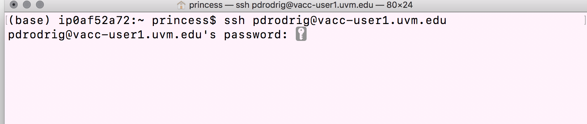

# Learning Objectives for Today's Lesson
- Log into the VACC, a high-performance computing cluster 
- Basics in navigation in CLI 
     + Copy data into your home directory 
     + List files in a directory

***

# Introduction to Command Line 
Command line interface (CLI) and graphical user interface (GUI) are different ways of interacting with a computer's operating system. Most people are familiar with the GUI as it is the default interface for most software. When using a GUI, you see visual representations of files, folders, applications, etc. However, when using the CLI, you will work largely with text representation of files, folders, input, and output. The shell is a program that presents a command line interface that allows you to control your computer by typing instructions with a keyboard. Using command line, you will be able to create new files, edit the contents of those files, delete files, and much more. 

<p align="center">

</p>

## How to access the shell
On a Mac or Linux machine, you can access a shell through a program called "Terminal" locally on your laptop. But to make things easier, we will be using terminal on the open source web portal called Vermont Advance Computing Center - Open OnDemand (VACC-OOD). Once on terminal, you will be learning the basics of shell programming available under the Bourne Again Shell (bash). 

*** 
# Introduction to Vermont Advance Computing Center Cluster (VACC)
First, what is the Vermont Advance Computing Center? To answer this, let's take a quick look at the basic architecture of a cluster environment.

<p align="center">

</p>

The image above reflects the many computers that make up a cluster. Each individual computer in the cluster is a lot more powerful than any laptop or desktop computer we are used to working with, and is referred to as a **"node"** (instead of computer). Therefore, a "cluster" is a large system consisting of 100s-1000s of nodes. Each node has a designated role, either for logging in or for performing computational analysis/work. A given cluster will usually have a few login nodes and several compute nodes.

Common characteristics of a Cluster: 
+ Large memory
+ Storage shared across nodes 
+ High speed interconnection network; suitable for high-throughput applications 
+ Shared by many users (*Slurm is used to schedule jobs and manage compute nodes. We will discuss this more at length later in the course*)

**As of March 2022, the VACC provides three Clusters:** 

+ BlackDiamond 
+ Bluemoon
+ DeepGreen 

We will primarily use the **Bluemoon** cluster for any downstream analysis. 

<p align="center">

</p>

Please note that more information can always be found at the [Vermont Advanced Computing Center website](https://www.uvm.edu/vacc). 

# VACC-OOD Overview 
For the duration of this course, each student will be provided with their own personal VACC account that they can use to access VACC-Open OnDemand (OOD).   

## What is Open OnDemand (OOD)?  
Open OnDemand (OOD) is an open source web portal for high performance computing (HPC) that provides users with an *easy-to-use* web interface to HPC clusters. 

Benefits of using OOD: 
1. Web-based, no additional software needs to be installed on your local machine
2. The easiest way to run graphical user interface (GUI) applications remotely on a cluster 
3. Typical computing with command-line requires a *high learning curve* whereas OOD is easy to use and simple to learn 

GUI applications offered by VACC-OOD: 

+ Equipped with **Terminal**: this is used to perform tasks on the command line (shell), both locally and on remote machines. 
<p align="center">

</p>

+ RStudio: an integrated development environment for R 
<p align="center">

</p>

## How to log-in to VACC-OOD (You should always do this!):  
1.  Use the [VACC-OOD](https://vacc-ondemand.uvm.edu) link to access the site https://vacc-ondemand.uvm.edu
2. Add your uvm netid and password 
3. You should be viewing the following dashboard

<p align="center">

</p>

4. To access the Terminal Go to <button>Clusters</button>  and click `>_VACC Shell Access`
<p align="center">

</p>

## How to log-in without VACC-OOD (Advanced users)

If you already had a VACC account and/or are currently working towards generating and analyzing your own NGS dataset, you may want to learn to log-in without VACC-OOD. 

To do so, first open your terminal locally on your computer. 

<p align="center">

</p>

You see the "$" symbol? That is where you write the "commands" that will be executed by shell (bash in this case) and your computer's kernel. The "$" is called the **"command prompt"**. 

<p align="center">

</p>

To connect to the login node on VACC:

1. Type in the `ssh` command at the command prompt followed by a space, and then type your username (e.g. uvm net id) plus the address of the cluster `@vacc-user1.uvm.edu`.

```bash
ssh username@vacc-user1.uvm.edu
```
> ssh means secure shell, and this is a method of securely communicating with another computer. 

2. Press the return/enter key and you should receive a prompt for your password. Type in your password and note that **the cursor will not move as you type** it in! This is normal and know that the computer is receiving and transmitting your typed password to the remote system, i.e. the VACC cluster.

<p align="center">

</p>

3. If this is the first time you are connecting to the cluster, **a warning will pop up** and will ask you if you are sure you want to do this; **type `Yes` or `Y`**. 

> **Tip** - Syntax for all commands on the command-line interface is the command followed by space and then optionally a few arguments.

Once logged in, you should see a new command prompt: 

<p align="center">

</p>

***
# Navigating the File System
## Copying example data folder 

Now that we are logged-in to the VACC, lets explore terminal. Your screen should look similar to the following: 

<p align="center">

</p>

The "$" is called the **"command prompt"**. 
The command prompt on VACC will have some characters before the `$`, something like `[username@vacc-user1 ~]`, this is telling you your username and the name of the login node you have connected to. 

***The dollar sign is a prompt which shows us that the shell is waiting for input. Moving forward, when typing commands, either from these lessons or from other sources, do not type in the command prompt $, only the command that follows it.***

The first thing to do is to check if there are any files in the data folder we are currently in. When you log in to a cluster, you will land within a folder designated specifically for your use, and is referred to as your "home directory". We will begin introducing a few commands that are used to list, create, inspect, rename, and delete files and/or directories. 

Let's list the contents of our home directory using a command called `ls`.

```bash
$ ls
```
> **Tip** - `ls` stands for "**l**i**s**t" and it lists the contents of a directory. 

**Question for students: What folders are you currently seeing in your home directory?**  

Now let's bring in a data folder from a different location on the cluster to our home directory by using the `cp` command. **Copy and paste the following command** all the way from `cp` and including the period symbol at the end `.`

```bash
cp -r /users/p/d/pdrodrig/unix_lesson/ .
```

> Let's break this down.  
'cp' is the command for copy. This command required you to specify the location of the item you want to copy (/users/p/d/pdrodrig/unix_lesson/) and the location of the destination (.); please note the space between the two in the command. The “-r” is an option that modifies the copy command to do something slightly different than usual. The "." means "here", i.e. the destination location is where you currently are.

Now, you should see "unix_lesson" show up as the output of `ls`. This is a folder we should all have in our home directory. 

```
ls
```

<p align="center">

</p>


## Listing contents of data folder 

Let's look at what is inside the folder "unix_lesson" and explore this further. We are use to clicking on a folder name to open it, however, now we are forced to change our mindset and open a folder or "directory" differently within the shell environment. 

To look inside the `unix_lesson` directory, we need to change which directory we are *in*. To do this we can use the `cd` command, which stands for "change directory". 

```bash
cd unix_lesson
```

Notice the change in your command prompt. The "~" symbol from before should have been replaced by the string `unix_lesson`. This means that our `cd` command ran successfully and we are now *in* the new directory. Let's see what is in here by listing the contents:

```bash
ls
```

You should see:

```
genomics_data  other  raw_fastq  README.txt  reference_data
```
Notice that `ls` has printed the name of the files and directories in the current directory in alphabetical order, arranged neatly into columns. 

### Arguments

There are five items listed when you run `ls`, but how do you know if these are files or directories with more items inside? 

To answer this question, we can modify the default behavior of `ls` by adding an **"argument"** to get more information. 

```bash
ls -F
```

```
genomics_data/  other/  raw_fastq/  README.txt  reference_data/
```

Anything with a "/" after its name is a directory. Things with an asterisk "*" after them are programs.  If there are no "decorations" after the name, it's a normal text file.

Each line of output represents a file or a directory. The directory lines start with `d`. 

### How to get more information on Arguments
Most commands will take additional arguments that control their behavior. How do we know what arguments are available for a particular command? The most commonly used shell commands have a manual available that can be accessed using the `man` command. Let's try this command with `ls`:

```bash
man ls
```

This will open the manual page for `ls` and you will lose the command prompt. It will bring you to a so-called "buffer" page, a page you can navigate with your mouse or if you want to use your keyboard we have listed some basic key strokes:
* 'spacebar' to go forward 
* 'b' to go backward
* Up or down arrows to go forward or backward, respectively

**To get out of the `man` "buffer" page and to be able to type commands again on the command prompt, press the `q` key!**

***

## Homework Assignment #1 (20 points)
For these "short" assignments you will have 48 hours to submit via Blackboard (by 10:05am on Thursday, January 19th). **Late assignments will not be accepted.** My suggestion is to complete while in-class and submit prior to leaving for the day. I will try my best to leave ~10 minutes at the end of class for students to complete during class.  

### Directions for Students: 
Open a new Microsoft Word Document to submit answers to questions 1-3. The first four lines of your document should contain the following:  
+ Your name
+ MMG232
+ Today's date
+ Homework Assignment #1  

### Task 1: 
* On Terminal, open the manual page for the `cp` command. Skim through the information. 
  
1)  What does the -u option stand for and what does it do?   
2)  Which option would you use to explain what is being done (i.e. verbose)?   
    
* Quit the `man` buffer page and come back to your command prompt.  

> **Tip** - Shell commands can get extremely complicated. No one can possibly learn all of these arguments, of course. So you will probably find yourself referring to the manual page frequently.

> **Tip** - If the manual page within the Terminal is hard to read , the manual exists online too. For example, here is the linux manual page for `cp`. https://man7.org/linux/man-pages/man1/cp.1.html In addition to the arguments, you can also find good examples online; ***Google is your friend.***


### Task 2: 
* Use the `-l` option for the `ls` command to display more information for each item in the `unix_lesson` folder. 
 
3) Submit a screenshot of your terminal screen and underneath describe what additional information is provided that you didn't see with the bare `ls` command. 

