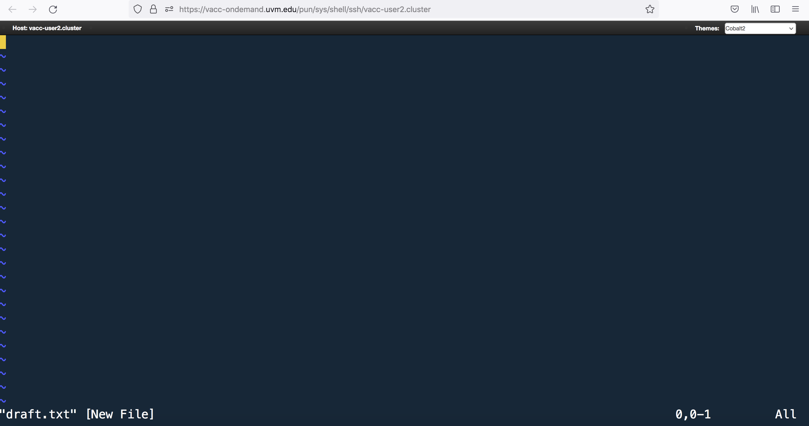

# Learning Objectives
  - Use vim and/or nano to create and edit files 

***

# Writing files

We've been able to do a lot of work with files that already exist, but what if we want to write and/or create our own files? Obviously, we're not going to type in sequence information for a FASTA file, but you'll see as we go that there are a lot of situations in which we would need to write/create a file or edit an existing file.

In order to create or edit files we will need to use a **text editor**. When we say, "text editor," we really do mean "text": these editors can only work with plain character data, not tables, images, or any other media. The types of text editors can generally be grouped into two categories: **graphical user interface (GUI) text editors** and **command-line editors**.

## GUI text editors

A GUI is an interface that has buttons and menus that you can click on to issue commands to the computer and you can move about the interface just by pointing and clicking. You might be familiar with GUI text editors, such as [BBEdit](http://www.barebones.com/products/bbedit/) and [Visual Studio Code](https://code.visualstudio.com/), which allow you to write and edit plain text documents. These editors often have features to easily search text, extract text, and highlight syntax from multiple programming languages. They are great tools, and indeed you should download one to use to create your own scripts in the future! 

## Command-line editors
Today we will be working with command-line editors. With command-line editors you must navigate the interface using the arrow keys and shortcuts, since you do not have the option to 'point-and-click'. Some popular editors include [Emacs](http://www.gnu.org/software/emacs/), [Vim](http://www.vim.org/), or a graphical editor such as [Gedit](http://projects.gnome.org/gedit/). These are editors which are generally available for use on high-performance compute clusters. There are also simpler editors available for use on the cluster (e.g. [nano](http://www.nano-editor.org/)), but tend to have limited functionality.

# Nano versus Vim 

## Introduction to nano 
Nano is a popular text editor of UNIX/Linux operating systems. Nano is easy-to-use but is limited in editing. 

To use nano: 

```
nano filename

nano demo.txt
```
After running the nano command, a new window will pop up where you can edit the file. Below is how the interface looks like, notice that the name of file appears on the top: 

<p align="center">

</p>

Go ahead and type the following:

```
Today is going to be a great day. 
```

At the bottom of the screen you will find some shortcuts on the nano editor. They use the <button>control</button> button. The most important one is: 

<button>control</button> + X 

This is to exit the editor. If there are changes, it will ask you whether to save them or not. Input Y for Yes, or N for No, then press <button>return</button>. 

>### Basic nano commands
>
>| key              | action                 |
>| ---------------- | ---------------------- |
>| <button>control</button> + X     | exit from the editor |
>| <button>control</button> + A      | Let's you jump from the beginning of the line |
>| <button>control</button> + E     | Let's you jump from the end of the line  |
>| <button>control</button> + Y      | Scroll page down |
>| <button>control</button> + V      | Scroll page up |
>| <button>control</button> + O      | Save the file |
>| <button>control</button> + K      | It cuts the entire selected line |

## Introduction to Vim 

Vim is another text editor, but it is much more powerful than nano because it offers extensive text editing options. We will explore some of the differences. 

> ### How do I keep track of all these shortcuts in Vim?
> To help you remember some of the keyboard shortcuts that are introduced below and to allow you to explore additional functionality on your own, hbctraining has already compiled a [cheatsheet linked here](https://github.com/hbctraining/In-depth-NGS-Data-Analysis-Course/blob/master/resources/VI_CommandReference.pdf). Download it to your computer, it is a useful resource to have open while using Vim.
> <p align="center">
> 
> </p>


### Vim Interface

You can create a document by calling a text editor (in our case `vim`) and providing the name of the document you wish to create. 

Change directories to the `~/unix_lesson/other` folder and create a document using called `draft.txt` using the `vim` command:

```bash
	
$ vim draft.txt
```
<p align="center">

</p>

>**Note the `"draft.txt" [New File]` typed at the bottom left-hand section of the screen.** This tells you that you just created a new file in vim. 


### Vim Modes
Vim has **_two basic modes_** that will allow you to create documents and edit your text:   

- **_command mode (default mode):_** will allow you to save and quit the program (and execute other more advanced commands).  

- **_insert (or edit) mode:_** will allow you to write and edit text


Upon creation of a file, vim is automatically in command mode. Let's _change to insert mode_ by typing <kbd>i</kbd>. **Note the `--INSERT--` at the bottom left hand of the screen.** Now type in a few lines of text:

<p align="center">

</p>

After you have finished typing, **press <kbd>esc</kbd> to enter command mode.** 

>**Note the `--INSERT--` has now disappeared from the bottom of the screen.**

>### Review of Vim modes
>
>| key              | action                 |
>| ---------------- | ---------------------- |
>| <button>i</button>     | insert mode - to write and edit text |
>| <button>esc</button>     | command mode - to issue commands / shortcuts  |


### Saving and Quitting

To **"write to file"** or save the modifications made to the file, **type <kbd>:w</kbd>** when in command mode. You can see the commands you type in the bottom left-hand corner of the screen. 

<p align="center">

</p>

After you have saved the file, the total number of lines and characters in the file will print out at the bottom left-hand section of the screen.

<p align="center">

</p>


Alternatively, we can **write to file (save changes) and quit** all at once by **typing <kbd>:wq</kbd>**. After typing `:wq` while on command mode, you will exist vim and be returned back to your command prompt.

> ### Review of saving and quitting
 >
> | key (in command mode)  | action           |
> | ---------------- | ---------------------- |
> | <button>:w</button>     | to write to file (save) |
> | <button>:wq</button>     | to write to file and quit |
> | <button>:q!</button>     | to quit without saving |


### Shortcuts in Vim
To edit the newly created `draft.txt` file, you can open it again with vim: `vim draft.txt`. First, change to *insert mode* and type a few additional lines (you can move around the lines using the arrows on the keyboard). This time we decide to **quit without saving** by going into command mode by pressing the <button>esc</button> key, and then **typing <kbd>:q!</kbd>**.
 
<p align="center">

</p>

While we cannot point and click to navigate the document, we can use the arrow keys to move around. However, navigating with arrow keys can be very slow, so Vim has shortcuts (which are completely unintuitive, but very useful as you get used to them over time). 

Create a new file called `spider.txt` using `vim`. Go into *insert mode* and enter the text as shown below in the screenshot: 

<p align="center">

</p>

Once you have finished typing, you can display line numbers by changing to *command mode* and then typing the <kbd>:set number</kbd> command. Later, if you choose to remove the line numbers you can reset it with <kbd>:set nonumber</kbd>.

<p align="center">

</p>

| key (in command mode)  | action                 |
| ---------------- | ---------------------- |
| <button>:set number</button>     | to number lines |
| <button>:set nonumber</button>     | to remove line numbers    |


**Save the document.** Check to see what mode you are currently in. **While in command mode**, try moving around the file `spider.txt` and familiarizing yourself with some of these shortcuts!  

**Navigating around the file**

| key (in command mode) | action                 |
| ---------------- | ---------------------- |
| <button>gg</button>     | to move to top of file |
| <button>G</button>     | to move to bottom of file     |
| <button>$</button>     | to move to end of line |
| <button>0</button>     | to move to beginning of line     |
| <button>w</button>     | to move to next word     |
| <button>b</button>     | to move to previous word     |

Practice some of the editing shortcuts, then **quit the document and remember to save changes**.

**Editing the file**

| key (in command mode) | action                 |
| ---------------- | ---------------------- |
| <button>dw</button>     | to delete word |
| <button>dd</button>     | to delete line     |
| <button>u</button>     | to undo |
| <button>Ctrl + r</button>     | to redo     |
| <button>/*pattern*</button>     | to search for a pattern (*n/N* to move to next/previous match)    |
| <button>:%s/*search*/*replace*/g</button>     | to search for a pattern and replace for all occurrences     |

**Class Exercise**

1. Open `spider.txt`, and delete the word "water" from line #2.
2. Quit without saving.
3. Open `spider.txt` again, and replace every occurrence of "spider" with "unicorn".
4. Delete: "Down came the rain." 
5. Save the file.
6. Undo your previous deletion.
7. Redo your previous deletion.
8. Delete the first and last words from each of the lines.
9. Save the file.
10. Open the file and take a screenshot of your terminal screen. Submit this as homework part A. 

*** 

## Homework Assignment #4 (30 points)

### **Please note that you will have until next class (Tuesday, January 31st) to submit this assignment. Late submissions will not be accepted.**  

### Directions for Students: 
Open a new Microsoft Word Document and submit two screenshot (Part A and Part B). The first four lines of your document should contain the following:  
+ Your name
+ MMG232
+ Today's date
+ Class Participation Assignment #2 

The scenario: 
You got the following line of codes from a trusted source but need to modify it so you can submit it to the VACC-Bluemoon server. You decide its time to make your own script. Follow the steps below: 

1. Create a new file called `script.sh` 
2. Paste in the code you got from a trusted source:

```
STAR --runThreadN 6 \
--runMode genomeGenerate \
--genomeDir /scratch2/username/chr1_hg38_STAR_index/ \
--genomeFastaFiles /reference_data_ensembl38/username/Homo_sapiens.GRCh38.dna.chromosome.1.fa \
--sjdbGTFfile /reference_data_ensembl38/username/Homo_sapiens.GRCh38.92.gtf \
```
3. Save the file. 
4. Replace every occurrence of "username" with your UVM netid. 
5. Delete: "scratch2" folder 
6. Change the --runThreadN from 6 to 4 
7. You just realized that the fasta and gtf you downloaded from Ensembl is actually from GRCh19 not CRCh38. This needs to be changed in your code. 
8. Save the file. 
9. Open the file and take a screenshot of your terminal screen. Submit this as homework part B. 


## Citation

*This lesson has been developed by members of the teaching team at the [Harvard Chan Bioinformatics Core (HBC)](http://bioinformatics.sph.harvard.edu/). These are open access materials distributed under the terms of the [Creative Commons Attribution license](https://creativecommons.org/licenses/by/4.0/) (CC BY 4.0), which permits unrestricted use, distribution, and reproduction in any medium, provided the original author and source are credited.*

* *The materials used in this lesson were derived from work that is Copyright © Data Carpentry (http://datacarpentry.org/). 
All Data Carpentry instructional material is made available under the [Creative Commons Attribution license](https://creativecommons.org/licenses/by/4.0/) (CC BY 4.0).* 
* *Original Authors: Sheldon  McKay, Bob Freeman, Mary Piper, Radhika Khetani, Meeta Mistry, Jihe Liu, Will Gammerdinger*