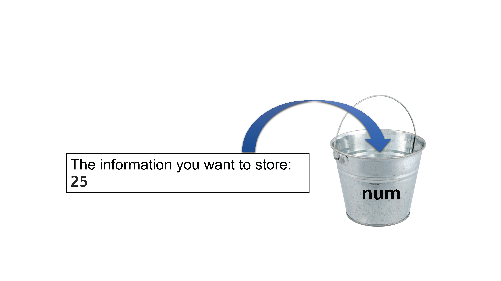

## Learning Objectives

- Capture previous commands into a shell script
- Implement variables in a shell script

## Shell scripts

Over the past 2.5 weeks, you have been introduced to a number of commands used to explore data files. To demonstrate the function of each command we have run them one at a time at the command prompt. The command prompt is useful for testing out commands and also performing simple tasks like exploring and organizing the file system. When we are running analyses which require a series of tasks to be run, there is a more efficient way to do this. 

Shell scripts are **text files that contain commands we know we want to run**. In today's lesson, you will be introduced to both a simple example and an advanced shell script example.

> ### Review of Vim modes
>
> ***You will be using nano and vim for this lesson, so before you get started, make sure you review the modes in vim.***
>
> | key              | action                 |
> | ---------------- | ---------------------- |
> | <button>i</button>     | insert mode - to write and edit text |
> | <button>esc</button>     | command mode - to issue commands / shortcuts  |

## A simple script

We are finally ready to see what makes the shell such a powerful programming environment. To create our first script, we are going to take some of the commands we have run previously and save them into a file so that we can **re-run all those operations** again later, by typing just **one single command**. For historical reasons, a bunch of commands saved in a file is referred to as shell script, but make no mistake, this is actually a small program! 

Interestingly, when working with Shell or on the command line you can give files any extension (.txt, .tsv, .csv, etc.). Similarly, for a shell script you don't need a specific extension. However, it is **best practice to give shell scripts the extension `.sh`** (bash shell script file). 

Move into the `raw_fastq` directory and create a new file using. 

We will call this script `difference.sh`: 

```bash
nano difference.sh
```

Using this script we will answer the question, what is the difference between using redirect (<) versus append(<<): 

We will recall the "grab" command from yesterday called `grep` with the same arguments: 

```
grep -B 1 -A 2 NNNNNNNNNN Mov10_oe_1.subset.fq > redirect.txt 
wc -l redirect.txt 
```
This shell script will do two things:
1. Create a file called redirect.txt 
2. Give us the word count for redirect.txt 

Now, lets add some verbosity to our script by using the `echo` command (verbosity is a good thing here!). The `echo` command is used to display a line of text that is passed in as an argument. This is a bash command that is mostly used in shell scripts to output status to the screen or to a file. 

```
grep -B 1 -A 2 NNNNNNNNNN Mov10_oe_1.subset.fq > redirect.txt 
echo "The word count for redirect.txt is:" 
wc -l redirect.txt 
```

To run the shell script you can use the `bash` or `sh` command, followed by the name of your script:

```bash
sh difference.sh
```

Let's now add to this to the script:

```
grep -B 1 -A 2 NNNNNNNNNN Mov10_oe_1.subset.fq >> append.txt 
echo "The word count for append.txt is:" 
wc -l append.txt 
```
The ouput should look like this: 
```
The word count for redirect.txt is:
     148 redirect.txt
The word count for append.txt is:
     148 append.txt
```

Now what happens if we run this script once more? 

```
The word count for redirect.txt is:
     148 redirect.txt
The word count for append.txt is:
     296 append.txt
```

Notice that the redirect.txt document, has the same word count as before while append.txt document doubled. The append command can not tell that the same material is being copied over and over again, and it will continue to do this. Therefore, you can end up with a document of duplicates depending on how the command/script is run. Meanwhile, the redirect will completely replace any contents that were written before - whether it was the same or not. 

***

## Bash variables

A *variable* is a common concept shared by many programming languages. **Think of variables as a temporary store, or "bucket", for a simple piece of information.** This bucket will have a name associated with it, therefore when referring to the information inside the bucket, we can use the name of the bucket instead! 

First, to create a variable in bash, you provide the name of the variable, followed by the equals sign, and finish with the value we want to assign to the variable. 

```
name_of_variable=value_of_variable
```
> Note that the variable name cannot contain spaces, nor can there be spaces on either side of the equals sign.

Let's start by creating a variable called `num` that has the number 25 stored inside it:

```bash
num=25
```
If we are using our bucket analogy - You can think of the variable `num` like this: 
<p align="center">

</p>

Once you press return, you will find yourself back at the command prompt. But nothing happened... so how do we know that we actually created a variable? 

One way to see the variable created is by using the `echo` command. As we learned earlier, this command takes the argument provided and prints it to the terminal. If we provide `num` as an argument it will be simply interpreted as a character string "num". We want `echo` to display the contents of the variable and not its name. To do this we need to **explicitly use a `$` in front of the variable name**:

```bash
echo $num
```

You should see the number 25 returned to you. Notice that when we created the variable, we did not use the `$`. The `$` is a standard shell notation for defining and using variables. 

Therefore, when defining the variable (i.e. setting the value) you can just type it as is, but when **retrieving the value of a variable you must use the `$`!** 

> **NOTE:** Variables are not physical entities like files. When you create files you can use `ls` to list contents and see if the file exists. When creating variables, to list all variables in your environment you can use the command `declare` with the `-p` option. You will notice that while you only have created one variable so far, the output of `declare -p` will be more than just one variable. These other variables are called environment variables. 
> 
> If you use `declare -p`, try piping it to the `grep` command followed by the name of the variable so you trim that list to only display the variable you are interested in:
> 
> `declare -p | grep num`
>

## Use variables as input to commands

So far, it is hard to see the utility of a variable and why we need it. One important aspect of the variable is that the value stored inside it can be used as input to commands. To demonstrate this we will create a new variable called `file`. We will store a character string as the value of the variable, specifically the name of one of the files in the `raw_fastq` directory:

```bash
file=Mov10_oe_1.subset.fq
```

Once you press return, you should be back at the command prompt. Let's check what's stored inside `file` using the `echo` command:

```bash
echo $file
```

Now let's use this variable `file` as input to one of the commands we previously learned:

```bash
wc -l $file
```
> **NOTE:** The variables we create in a session are system-wide, and independent of where you are in the filesystem. This is why we can reference it from any directory. However, it is only available for your current session. If you exit the cluster and login again at a later time, the variables you have created will no longer exist.

***

## Assigning the output from a command to a variable

When creating shell scripts, variables are used to store information that can be used later in the script (once or many times over). The value stored can be hard-coded in as we have done above, assigning the variable a numeric or character value. Alternatively, the value stored can be the output of another command. We will demonstrate this using a new command called `basename`.

The **`basename` command** is used for extracting the base name from a file path, which is accomplished using **string splitting**. Let's try an example, by first moving back to your home directory:

```bash
cd
```

Then we will run the `basename` command on one of the FASTQ files. Be sure to specify the path to the file:

```bash
basename ~/unix_lesson/raw_fastq/Mov10_oe_1.subset.fq
```

**What is returned to you?**

The path was split into all text leading up to the last `/` (which is `~/unix_lesson/raw_fastq/`) and everything after the `/` which is the file name `Mov10_oe_1.subset.fq`. The command **returns only the file name**. 

Now, suppose we wanted to also **trim off the file extension** (i.e. remove `.fq` leaving only the file *base name*). We can do this by **adding a parameter** to the command to specify what string of characters we want trimmed.

```bash
basename ~/unix_lesson/raw_fastq/Mov10_oe_1.subset.fq .fq
```

You should now see that only `Mov10_oe_1.subset` is returned. 


***

**Class Exercise**

1. How would you modify the above `basename` command above to only return `Mov10_oe_1`?
2. Use `basename` with the file `Irrel_kd_1.subset.fq` as input. Return only `Irrel_kd_1` to the terminal.

	<details>
		<summary><b><i>Answers</i></b></summary>
		<p><i>Question 1</i><br>
		<code>basename ~/unix_lesson/raw_fastq/Mov10_oe_1.subset.fq .subset.fq</code></p>
		<p><i>Question 2</i><br>
		<code>basename ~/unix_lesson/raw_fastq/Irrel_kd_1.subset.fq .subset.fq</code></p>

***


The `basename` command returns a character string and this is totally something we can store inside a variable! To do this we need to use a special syntax because when we run the command we have spaces. If you remember earlier, one of the rules of creating variables is that there cannot be any spaces. 

> **NOTE:** The special syntax involves a key that is probably not used much on your keyboard, it is **the backtick key** <kbd>`</kbd>. On most keyboards this character is located just underneath the <kbd>esc</kbd> key. If you have trouble finding it you can also just copy and paste it from the materials.

The command that we are running is wrapped in backticks (one at the beginning and one at the end), and then we assign it to the variable as we would any other value. Let's try this with the `Mov10_oe_1.subset.fq` example from above:

```bash
samplename=`basename ~/unix_lesson/raw_fastq/Mov10_oe_1.subset.fq .fq`
```

Once you press return you should be back at the command prompt. Check to see what got stored in the `samplename` variable:

```bash
echo $samplename
```

> #### The `basename` command
> It is hard to see the utility of this command by just running it at command-line, but it is very useful command when creating scripts for analysis. Within a script it is common to create an output file and the `basename` allows us to easily create a prefix to use for naming the output files. We will demonstrate this in more detail shortly. 


## Shell scripting with bash variables using Jupyter notebook 

Now it's time to put all of these concepts together to create a more advanced version of the script that we started with at the beginning of this lesson! This script will allow the user to get information on any given directory. These are the steps we will code into our shell script:

1. Assign the path of the directory to a variable
2. Create a variable that stores only the directory name (and no path information)
3. Move from the current location in the filesystem into the directory we selected in 1.
4. List the contents of the directory
5. List the total number of files in the directory


It seems like a lot, but you are equipped with all the necessary concepts and commands to do this quite easily!

Let's get started by moving into the `other` directory and creating a script called `directory_info.sh`:

```bash
cd ~/unix_lesson/other
directory_info.sh
```

In this script, we will be adding **comments by using the hashtag symbol `#`**. Lines in your script that begin with `#` will not be interpreted as code by Shell. Comments are crucial for proper documentation of your scripts. This will allow your collaborators or your future self to know what each line of code is doing. 

We will begin with a first comment describing the **usage of this script**. This lets anyone who is using the script know what it does and what they need to provide (if anything). In our case we need the user to provide a path to the directory of interest. This will be assigned to a variable for use later in the script.

```bash
## USAGE: Provide the full path to the directory you want information on
dirPath=~/unix_lesson/raw_fastq
```

Next, we will create another variable to store the directory name. To get the directory name we can use `basename` command and extract it from the user provided path. *Note the use of the `$` to retrieve the value stored inside the variable!*

```bash
# Get only the directory name
dirName=`basename $dirPath`
```

The next few tasks we want to execute require simple commands for changing directories (`cd`), listing contents of a directory (`ls -l`). We can add these into our script making sure we are referencing the correct variable and also including meaningful `echo` statements for verbosity.

```bash
echo "Reporting on the directory" $dirName "..."

# Move into the directory
cd $dirPath

echo "These are the contents of" $dirName
ls -l 
```

The final task of reporting the total number of files will require us to pipe (`|`) together multiple commands:

```bash
echo "The total number of files contained in" $dirName
ls | wc -l

echo "Report complete!"
```

After adding in a final `echo` statement, we are all set with script! Make sure that your script looks similar to what we have listed below. If it does, save and exit Vim. 

```bash
## USAGE: Provide the full path to the directory you want information on
dirPath=~/unix_lesson/raw_fastq

# Get only the directory name
dirName=`basename $dirPath`

echo "Reporting on the directory" $dirName "..."

# Move into the directory
cd $dirPath

echo "These are the contents of" $dirName
ls -l 

echo "The total number of files contained in" $dirName
ls | wc -l

echo "Report complete!"
```


## Summary   

In today's lesson, we described shell scripts and introduced a few related concepts that are helpful when you are starting out. It is important to understand each of the indvidual concepts, but also to see how they all come together to add flexibility and efficency to your script. Later on we will further illustrate the power of scripts and how they can make our lives (when coding) much easier. Any type of data you will want to analyze will inevitably involve not just one step, but many steps and perhaps many different tools/software programs. Compiling these into a shell script is the first step in creating your analysis workflow!

***

## Homework Assignment #6 (40 points)

### **Please note that you will have until Tuesday, February 7th at 11:59PM to submit this homework assignment. Late submissions will not be accepted.**  

### Directions for Students: 
Open a new Microsoft Word Document and submit answers to questions below. The first four lines of your document should contain the following:  
+ Your name
+ MMG232
+ Today's date
+ Homework Assignment #6

### Part A: 
In today's lesson you made the following variable:
```bash
file=Mov10_oe_1.subset.fq
```

1. Use the `$file` variable as input to the `head` and `tail` commands, and modify the arguments to display only four lines. Provide the lines of code used and report the header lines (`@HWI` - the first line only!) you retrieve from each command. 
2. Create a new variable called `meta` and assign it the value `Mov10_rnaseq_metadata.txt` within the raw_fastq directory. For the following questions, use the `$meta` variable but do not change directories. Provide the code you would run to:
	1. Display the contents of the file using `cat`.
	2. Retrieve only the lines which contain normal samples. (*Hint: use `grep`*).  


### Part B: 
In today's lesson you made the following script: directory_info.sh: 

1. Run the script `directory_info.sh`. Report what gets printed to the screen.
2. Open up the script `directory_info.sh`. Change the approproiate line of code so that our directory of interest is `~/unix_lesson/genomics_data`. Save and exit. 
3. Run the script with the changes and report what gets printed to the screen.


***
## Citation

*This lesson has been developed by members of the teaching team at the [Harvard Chan Bioinformatics Core (HBC)](http://bioinformatics.sph.harvard.edu/). These are open access materials distributed under the terms of the [Creative Commons Attribution license](https://creativecommons.org/licenses/by/4.0/) (CC BY 4.0), which permits unrestricted use, distribution, and reproduction in any medium, provided the original author and source are credited.*

* *The materials used in this lesson were derived from work that is Copyright © Data Carpentry (http://datacarpentry.org/). 
All Data Carpentry instructional material is made available under the [Creative Commons Attribution license](https://creativecommons.org/licenses/by/4.0/) (CC BY 4.0).*
* *Adapted from the lesson by Tracy Teal. Original contributors: Paul Wilson, Milad Fatenejad, Sasha Wood and Radhika Khetani for Software Carpentry (http://software-carpentry.org/)*

* *Other Authors: Meeta Mistry, Bob Freeman, Mary Piper, Radhika Khetani, Jihe Liu, Will Gammerdinger*


